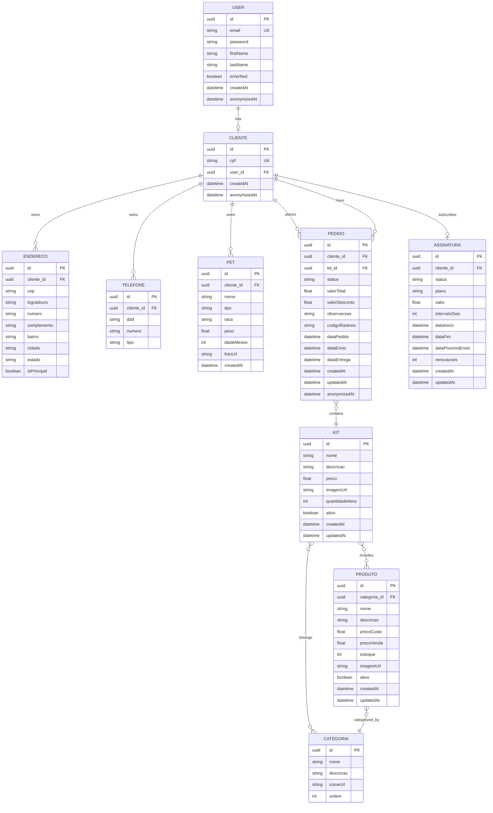

# Surpreenda Pet

E-commerce de kits surpresa recorrentes para cães e gatos.

## Stack

| Componente | Versão |
|---|---|
| PHP | 8.3 |
| Symfony | 7.4 |
| Doctrine ORM | 3.x |
| PostgreSQL | 16 |
| Twig | Mobile-first templates |

## Arquitetura

- **Domain-Driven Design** por bounded context (Entity, Enum, Repository, Service)
- **UUID v4** como identificador primário em todas as entidades
- **Doctrine Attributes** para mapeamento ORM
- **Enums PHP 8** para tipagem forte de estados
- **DataAnonymizer** para conformidade LGPD

## Estrutura de Pastas

```
src/
├── Entity/          # Entidades Doctrine
├── Enum/            # Enums tipados (PetType, OrderStatus, SubscriptionStatus)
├── Repository/      # Repositórios com queries customizadas
├── Security/
│   └── Privacy/     # Serviços de anonimização LGPD
└── Kernel.php
config/
├── packages/        # Configuração de bundles
├── services.yaml    # Injeção de dependências
└── bundles.php      # Bundles registrados
migrations/          # Migrations Doctrine
compose.yaml         # Docker Compose
Dockerfile           # Imagem PHP
```

## Entidades

### User
- Identificação via UUID v4
- Autenticação com Security Component do Symfony
- Relação 1:1 com Cliente

### Cliente
- Identificação via UUID v4
- Relação 1:N com Endereco, Telefone, Pet, Pedido
- Relação 1:1 com Assinatura

### Produto
- Identificação via UUID v4
- Relação N:1 com Categoria
- Relação M:N com Kit

### Kit
- Identificação via UUID v4
- Relação M:N com Produto e Categoria
- Cálculo automático de custo total

### Assinatura
- Identificação via UUID v4
- Relação 1:1 com Cliente
- Status: ACTIVE, PAUSED, CANCELLED, EXPIRED

### Pedido
- Identificação via UUID v4
- Relação N:1 com Cliente e Kit
- Status: PENDING, CONFIRMED, SHIPPED, DELIVERED, CANCELLED

## Diagrama de Entidades (Mermaid)



## Enums

| Enum | Valores |
|---|---|
| `PetType` | `dog`, `cat` |
| `OrderStatus` | `pending`, `confirmed`, `shipped`, `delivered`, `cancelled` |
| `SubscriptionStatus` | `active`, `paused`, `cancelled`, `expired` |

## LGPD - Anonimização de Dados

O serviço `App\Security\Privacy\DataAnonymizer` fornece:

| Método | Comportamento |
|---|---|
| `anonymizeEmail()` | Gera hash SHA-256 + salt único do e-mail |
| `anonymizeCpf()` | Gera hash irreversível do CPF |
| `anonymizeString()` | Hash genérico para strings |
| `anonymizePhone()` | Mascara dígitos mantendo os 4 últimos |
| `anonymizeAddress()` | Hash do endereço completo |
| `getAnonymousName()` | Retorna nome padrão de usuário anonimizado |

Campos `anonymizedAt` nas entidades `User`, `Cliente` e `Pedido` permitem auditoria.

## Docker Services

| Serviço | Imagem | Porta |
|---|---|---|
| `php` | PHP 8.3-fpm (custom) | 8000 |
| `database` | PostgreSQL 16 | 5432 |
| `mailer` | Mailpit | 1025 / 8025 |

## Comandos Úteis

```bash
# Subir serviços
docker compose up -d

# Verificar schema
docker compose run --rm php php bin/console doctrine:schema:validate

# Criar migration
docker compose run --rm php php bin/console make:migration

# Aplicar migrations
docker compose run --rm php php bin/console doctrine:migrations:migrate

# Limpar cache
docker compose run --rm php php bin/console cache:clear
```

## Próximos Passos

- [ ] Controllers CRUD (User, Cliente, Pet, Produto, Kit, Pedido, Assinatura)
- [ ] Security (LoginFormAuthenticator, Voter, Firewall)
- [ ] Twig Templates (mobile-first)
- [ ] Service Layer (AssinaturaService, PedidoService, KitBuilderService)
- [ ] Tests (PHPUnit)
- [ ] API Endpoints (Symfony API Platform)
- [ ] Integração de Pagamento (Stripe/PagSeguro)
- [ ] Notificações (Mercure/SSE)
- [ ] Admin Dashboard (Symfony UX/EasyAdmin)
